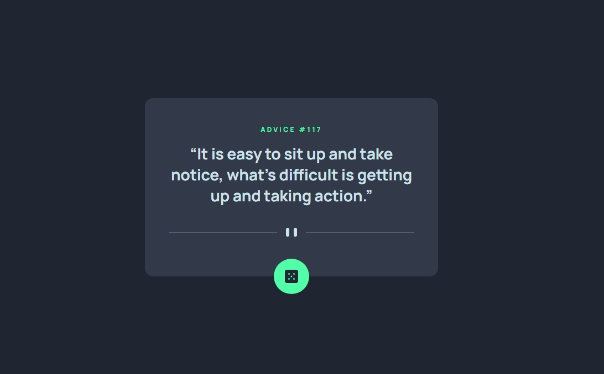

# Advice Generator App

This React application is a functional implementation of the Frontend Mentor Advice Generator App challenge. It provides users with a visually appealing and interactive way to generate random advice.

  

# The challenge

build out this advice generator app using the [Advice Slip API](https://api.adviceslip.com/)

Your users should be able to:

- View the optimal layout for the app depending on their device's screen size
- See hover states for all interactive elements on the page
- Generate a new piece of advice by clicking the dice icon

**Features:**

* The app adapts seamlessly to different screen sizes, ensuring optimal layout for desktop, tablet, and mobile devices.
* Clicking the dice icon fetches a new piece of advice from the Advice Slip API: https://api.adviceslip.com/. This API provides random advice content.

**Technologies:**

- [Vite + React](https://vitejs.dev) - JS library
- [Axios](https://axios-http.com/docs/intro) - for making API requests
- HTML
- CSS
- JavaScript

**Installation:**

Clone this repository using `git clone https://github.com/rohanvron/Advice-Generator-App.git.`
Install dependencies using `npm install` or `yarn install`. This will install React, JSX, CSS dependencies, and Axios.

**Frontend Mentor Challenge:**

This app serves as a solution to the Frontend Mentor Advice Generator App challenge. It fulfills the required criteria, including responsive design, hover states, and random advice generation.

## Contributing

Pull requests are welcome. For major changes, please open an issue first to discuss what you would like to change.

if you’re looking to enhance it, here are a few suggestions:

* Implement dark/light mode theme switching.
* Enhance user experience with additional animations or interactive features.
* Add topic filters so users can get advice tailored to their interests.

## License

This project is licensed under the MIT License. See the `LICENSE` file for more details.